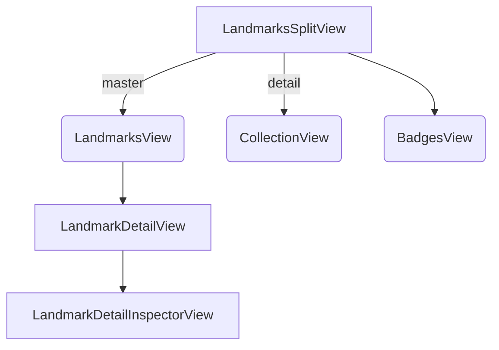

# Landmarks App - Technical Overview

A SwiftUI app leveraging Apple's Liquid Glass design (iOS 26/macOS Tahoe) for exploring landmarks, managing collections, and earning activity badges.

## Liquid Glass Implementation

**Glass Effects:**
- `.glassEffect(_:in:isEnabled:)` - Applied to custom views (e.g., `BadgeLabel`)
- `GlassEffectContainer` - Groups glass elements in `BadgesView.swift`
- `.glassEffectID(_:in:)` - Enables morphing animations between elements
- `.buttonStyle(.glass)` - System glass style for buttons

**Dynamic UI:**
- `backgroundExtensionEffect()` - Extends content beyond safe areas (`LandmarkDetailView`)
- `flexibleHeaderContent()` & `flexibleHeaderScrollView()` - Dynamic headers
- Floating Liquid Glass sidebar in `NavigationSplitView`

## App Architecture

**Navigation:**
- `NavigationSplitView` (`LandmarksSplitView.swift`) - Master-detail interface
- Three main sections: Landmarks, Collections, Badges
- `.searchable` modifier - Global landmark search
- `.inspector` modifier - Secondary info pane for details

**Core Features:**
- **Landmarks**: Browse, view details, mark favorites
- **Collections**: Create/manage custom groups, built-in "Favorites"
- **Badges**: Activity achievement system with glass effects
- **Maps**: `MapView.swift` with `MKMapItemRequest` integration

**UI Components:**
- Floating toolbars with `ToolbarSpacer` grouping
- `Menu` for collection management (`LandmarkCollectionsMenu.swift`)
- `.menuIndicator(.hidden)` for clean icon placement
- `confirmationDialog` with `.editButtonTransition()` effects
- Custom `showsBadges()` view modifier for overlay display

## Data Model
- `ModelData` - Central data management
- `Landmark` - Core landmark structure
- `LandmarkCollection` - User collections
- Persistent storage via CloudKit/local data

---

## Getting Started (Local Setup)

1. **Prerequisites**
   • Xcode 15.3+ (Swift 5.10, iOS 18 / macOS 15 SDKs).  
   • macOS 14+ with the Xcode‐installed command-line tools.
2. **Open & Run**
   ```bash
   git clone <repo>
   open Landmarks/Landmarks.xcodeproj
   ```
   Select the *Landmarks* scheme and press ⌘R to run on the iOS simulator or a connected device.
3. **Swift Data / CloudKit**
   The project currently ships with an in-memory `MockDataService`.  Replace it with a real implementation (e.g. `FirebaseDataService`) for production.

## Project Structure

```
LandmarksApp.swift        // App entry / DI container
Model/                    // Business logic & domain models
Resources/                // Assets, xcstrings, entitlements
Views/                    // SwiftUI feature folders (Landmarks, Collections…)
└─ Landmarks Split View   // Navigation shell
└─ Map                    // Cross-platform MapKit wrapper
└─ Badges                 // Glass-animated achievement UI
```

### Key Modules

• **ModelData** – Observable singleton injected via `.environment()`; holds global app state and routing (`NavigationPath`).  
• **DataService** – Protocol abstracting persistence.  The default `MockDataService` hydrates `ModelData.landmarks` from `LandmarkData.exampleData`.
• **Landmark / LandmarkCollection** – Codable domain models that conform to `Transferable` for drag-and-drop & share sheet preview support.
• **Activity / Badge / BadgeProgress** – Gamification system powering the *Badges* tab.

### Navigation Flow



• `NavigationSplitView` hosts top-level tabs (`NavigationOptions`).  
• Secondary `NavigationStack` pushes `LandmarkDetailView` or `CollectionDetailView`.
• `.inspector` is toggled from `LandmarkDetailView` to show additional facts while keeping the main content visible.

## Styling & Design System

All paddings, corner-radii, and spacing live in `Constants.swift`.  This makes it simple to tweak the design across **iOS**, **iPadOS**, and **macOS** with compile-time checks via `#if os()`.

### Liquid Glass Guidelines

1. Every *card* or *badge* uses `.glassEffect(_:in:isEnabled:)` for depth & morphing.
2. Wrap multiple glass views in `GlassEffectContainer` to reduce GPU load.
3. Use `.glassEffectID(_:in:)` when animating between matched views (e.g. badge earned → badge list).

## Localization

Strings are stored in `.xcstrings` and referenced using *generated* Swift enums (e.g. `.LandmarkData.saharaDesertName`).  Use Xcode 15's *String Catalog* editor to add new localizations.

## Testing & Previews

• All views contain inline `#Preview` blocks.  Run *Xcode Previews* for instantaneous design validation.  
• Unit tests live in *LandmarksTests* (create if missing).  Prioritize pure model tests (e.g. `BadgeProgress`) and view snapshot tests with *XCTest + ViewInspector*.

## Coding Conventions

• Prefer `@Observable` over `ObservableObject` (SE-0404).  
• Put feature-scoped extensions in the same file with `// MARK:` headers to limit file count.  
• Commit with Conventional Commits (`feat:`, `fix:`, `chore:`).  
• Enable *SwiftLint* (configuration TBD) to enforce rules.
